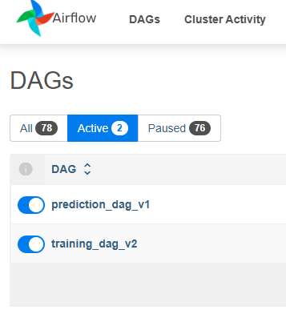
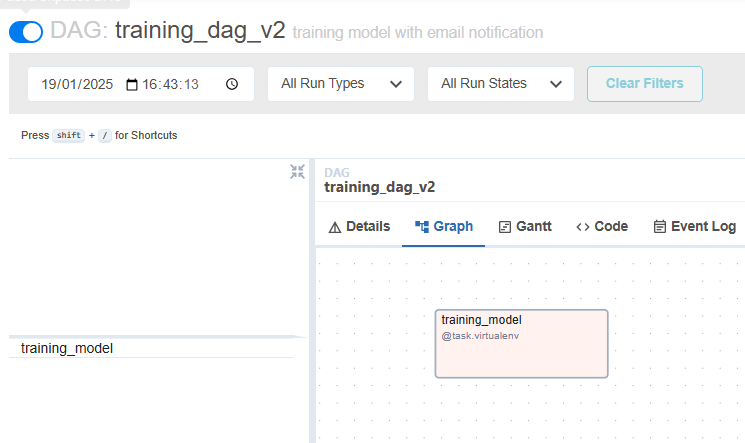
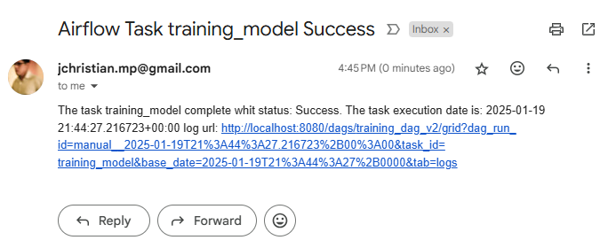
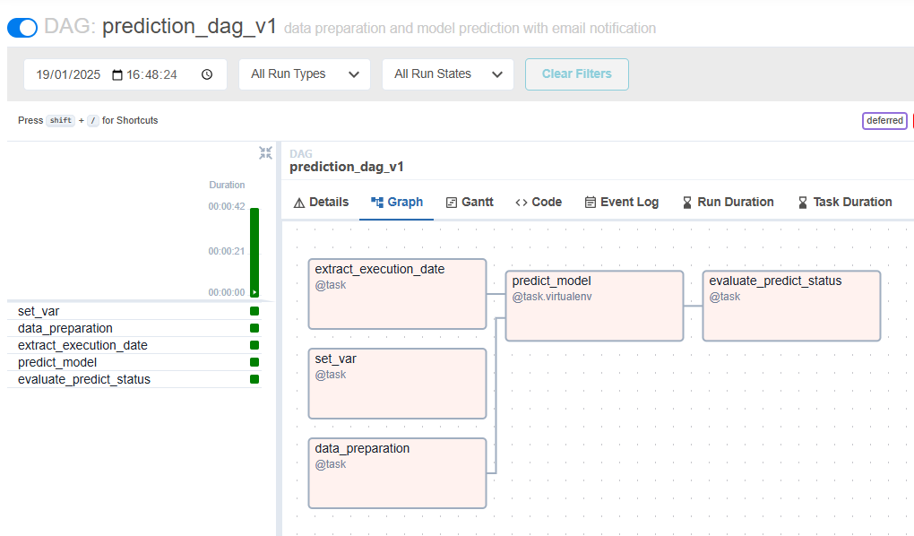
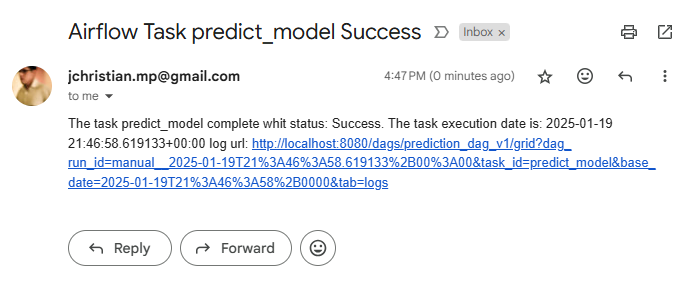

# Asignación: Creación de DAGs en Airflow para Entrenamiento y Predicción de Modelos de Machine Learning

## Dags:



## Training Dag:
```
@dag(
    dag_id="training_dag_v2",
    default_args=default_args,
    description='training model with email notification',
    on_failure_callback = lambda context: failure_email(context),
    on_success_callback = lambda context: success_email(context),
    schedule=None,
)
def trainingdag():
    training_model()

training_dag = trainingdag()
```


## Training Success email:



## Prediction Dag:
```
@dag(
    dag_id="prediction_dag_v1",
    default_args=default_args,
    description='data preparation and model prediction with email notification',
    on_failure_callback = lambda context: failure_email(context),
    on_success_callback = lambda context: success_email(context),
    schedule=None
)
def predictiondag(): 
    set_var()
    evaluate_predict_status(
        task_predict_model(
            data_preparation(),
            task_extract_execution_date())
            )
    
prediction_dag = predictiondag()
```



## Prediction Success email:



